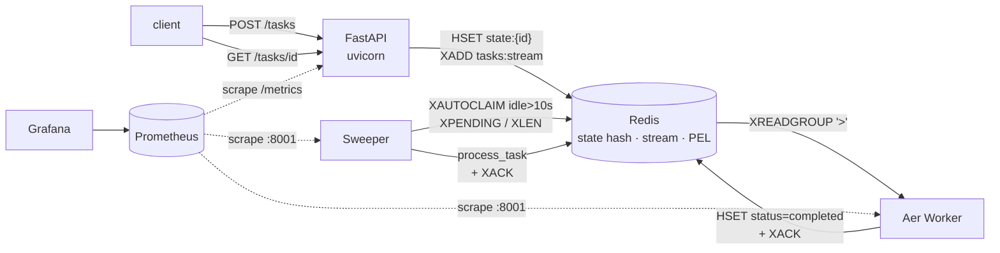
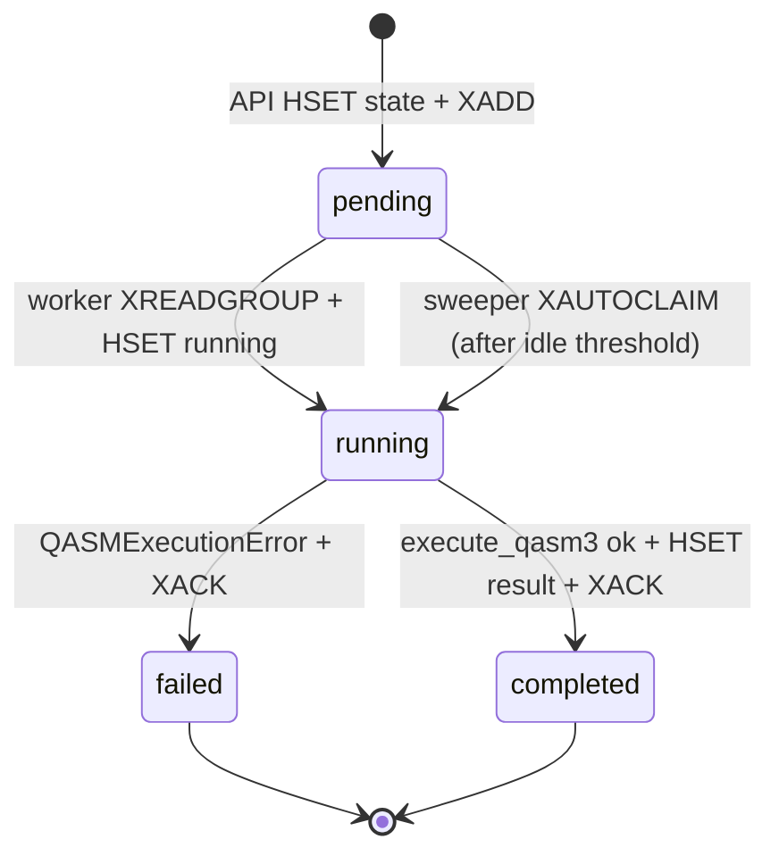

# Classiq QASM Runner

Production-grade async API for executing QASM3 quantum circuits on the Qiskit
[AerSimulator](https://qiskit.github.io/qiskit-aer/). Submits accept in
milliseconds; circuits run on background workers; results are retrievable by
task id. No task is lost when a worker dies mid-execution.

```bash
docker compose up --build
```

| Surface | URL |
| --- | --- |
| API | http://localhost:8000 |
| Prometheus | http://localhost:9090 |
| Grafana (anonymous viewer) | http://localhost:3000 |
| Worker / sweeper metrics | scraped internally on `:8001` |

---

## API

### `POST /tasks`

Submit a serialized QASM3 circuit. Returns immediately with a task id.

```bash
curl -X POST http://localhost:8000/tasks \
  -H 'content-type: application/json' \
  -d '{"qc": "OPENQASM 3.0; include \"stdgates.inc\"; qubit[2] q; bit[2] c; h q[0]; cx q[0], q[1]; c[0] = measure q[0]; c[1] = measure q[1];", "shots": 1024}'

{"task_id":"6c2…","message":"Task submitted successfully."}
```

Body schema: `qc` (string, required), `shots` (int, default 1024, range
1–100 000).

### `GET /tasks/{task_id}`

Returns one of three shapes:

```json
{"status":"completed","result":{"00":512,"11":512}}
{"status":"pending","message":"Task is still in progress."}
{"status":"error","message":"Task not found."}
```

The same `error` shape carries a different `message` for tasks that failed
during execution (e.g. malformed QASM3).

### Auxiliary endpoints

| Path | Purpose |
| --- | --- |
| `/healthz` | Liveness — unconditional 200 |
| `/readyz` | Redis ping + consumer-group existence check |
| `/metrics` | Prometheus exposition |
| `/docs`, `/openapi.json` | FastAPI auto-generated API docs |

---

## Architecture



Three application services share one image; each runs a different entrypoint:

| Service | Entrypoint | Role |
| --- | --- | --- |
| `api` | `uvicorn app.main:app` | Validates input, writes task state, enqueues |
| `worker` | `python -m app.worker.main` | Consumes via `XREADGROUP '>'`, runs Aer |
| `sweeper` | `python -m app.sweeper.main` | Reclaims stuck PEL entries via `XAUTOCLAIM` |

Redis hosts three things in one process: the durable result store (a hash per
task), the work queue (Redis Stream), and the in-flight bookkeeping (Pending
Entries List). AOF persistence (`appendonly yes`) is enabled.

### Task lifecycle



### Recovery flow (the headline reliability claim)

```mermaid
sequenceDiagram
    autonumber
    actor Client
    participant API
    participant Redis
    participant Worker
    participant Sweeper

    Client->>API: POST /tasks {qc}
    API->>Redis: HSET state:T1 status=pending qc=…
    API->>Redis: XADD tasks:stream {task_id:T1}
    API-->>Client: 202 {task_id:T1}

    Worker->>Redis: XREADGROUP > (claims T1 into PEL)
    Worker->>Redis: HSET state:T1 status=running
    Note over Worker: 💥 SIGKILL mid-execution<br/>(XACK never fires; T1 stuck in PEL)

    loop every SWEEPER_INTERVAL_S (2s)
        Sweeper->>Redis: XAUTOCLAIM idle ≥ 10s
    end
    Sweeper->>Redis: XAUTOCLAIM finds T1
    Sweeper->>Redis: process_task (run on Aer)
    Sweeper->>Redis: HSET state:T1 status=completed result=… + XACK

    Client->>API: GET /tasks/T1
    API->>Redis: HGETALL state:T1
    API-->>Client: 200 {status:completed, result:…}
```

---

## Architectural Decisions

Detailed ADRs live in [`docs/adr/`](docs/adr/). The headline calls:

| Decision | Chosen | Rejected (why) |
| --- | --- | --- |
| **Async runtime** | **Custom Python worker on Redis Streams** | Celery (introduces a framework I'd be learning during a 48h deadline). RQ (similar issue plus weaker delivery semantics). Kafka (single-producer / single-consumer-group workload; the JVM compose footprint signals over-provisioning rather than rigor). Postgres `SELECT ... FOR UPDATE SKIP LOCKED` (excellent if Postgres were already justified by transactional state — it isn't here). |
| **Task state** | **Redis hash (`state:{task_id}`)** | Postgres (adds a second datastore for a state machine with five fields; warranted at scale when audit/analytical queries appear). |
| **No-task-loss mechanism** | **Sweeper + `XAUTOCLAIM` over the PEL** | Manual retry counters in Postgres (more correct, more code). Distributed locks (irrelevant — at-least-once delivery + idempotency at the consumer is the production pattern). |
| **Observability** | **Prometheus + Grafana + structlog JSON to stdout** | Distributed tracing (Tempo/Jaeger gold-plating for a single-hop synchronous flow). ELK (Logstash is a 1 GB JVM tax for grok-parsing already-JSON logs — Filebeat → ES would be the production path). |

---

## Reliability Guarantees

Tasks are durable end-to-end under single-worker crash, broker restart, and
ungraceful shutdown.

- **At-least-once delivery.** Submissions are persisted to Redis Streams via
  `XADD` *after* the state row is written, before the API returns `202`.
  Workers consume with `XREADGROUP BLOCK=2000 COUNT=1` (prefetch-1
  equivalent, bounding blast radius to one task per crash) and `XACK` *only*
  after the terminal result is committed.
- **Crash recovery.** Entries sit in the Pending Entries List from claim to
  ack. The sweeper scans `XPENDING` every `SWEEPER_INTERVAL_S` (2 s) and
  `XAUTOCLAIM`s entries idle beyond `SWEEPER_IDLE_MS` (10 s by default).
  Reclaimed entries flow through the same `process_task` path as fresh
  deliveries, with the per-task `attempts` counter incremented.
- **Idempotency.** A re-delivered task whose state is already terminal
  (`completed`/`failed`) short-circuits to `XACK` without re-execution — so
  the worker dying *after* the result was written but *before* `XACK` still
  produces exactly-one execution.
- **Bounded retries.** `MAX_ATTEMPTS_DEFAULT = 3`; the fourth delivery
  transitions the task to `failed` with `max_retries_exceeded`. Surfaces
  through `GET /tasks/{id}` as `{status: error, message: ...}`.
- **Graceful shutdown.** Workers handle SIGTERM via an `asyncio.Event` and
  `add_signal_handler`. The XREADGROUP block timeout (2 s) bounds shutdown
  latency; `stop_grace_period: 60s` in compose gives an in-flight simulation
  time to finish + XACK before SIGKILL.

Assumptions: Redis runs with `appendonly yes`, single-region deployment, and
metrics are eventually consistent on the 5 s scrape interval (dashboards are
for trend detection, not transactional correctness).

---

## Observability

### Structured logs

Every log line is a JSON record on stdout, ready for Filebeat → Elasticsearch
or Promtail → Loki ingestion. Example task lifecycle (correlated by
`task_id`):

```json
{"event":"task.accepted","task_id":"6c2…","qc_len":125,"shots":1024,"service":"api",…}
{"event":"task.started","task_id":"6c2…","attempts":1,"service":"worker",…}
{"event":"task.completed","task_id":"6c2…","duration_s":0.086,"outcomes":2,
 "qubit_bucket":"1-5","service":"worker",…}
```

### Metrics

| Metric | Type | Labels | Source |
| --- | --- | --- | --- |
| `tasks_total` | counter | `event` (accepted, started, completed, failed, reclaimed, idempotent_ack, max_retries, unknown_ack) | api + worker + sweeper |
| `task_duration_seconds` | histogram | `qubit_bucket` (1-5, 6-10, 11-20, 20+) | worker + sweeper |
| `stream_pending` | gauge | — | sweeper (every cycle) |
| `stream_length` | gauge | — | sweeper (every cycle) |
| `http_request_duration_seconds` | histogram | `method`, `route` (template), `status` | api |

Prometheus scrapes all three jobs every 5 s. Grafana auto-loads a
provisioned dashboard at <http://localhost:3000> (anonymous viewer)
with four panels: throughput by event, p50/p95 latency, queue depth,
HTTP p95 by route.

---

## Testing

| Suite | What it covers | Speed |
| --- | --- | --- |
| `tests/test_health.py` | `/healthz` liveness | fast |
| `tests/test_post_tasks.py` | POST persistence, XADD, Pydantic validation | fast |
| `tests/test_get_task.py` | All five state→response mappings | fast |
| `tests/test_worker_happy.py` | Worker XREADGROUP → Aer → state transitions; idempotency; bad QASM | fast |
| `tests/test_sweeper.py` | `XAUTOCLAIM` reclaim, retry cap, terminal-state ack, no-op | fast |
| `tests/test_e2e.py` | Full POST → worker → GET lifecycle; concurrent submissions; OpenAPI schema | fast |
| `tests/test_chaos.py` | Sweeper recovers an orphaned PEL entry against the live compose stack | slow, opt-in via `--run-chaos` |

Inside the container:

```bash
docker compose exec api pytest -q                # default — 21 pass, chaos skipped
docker compose exec api pytest -q --run-chaos    # includes chaos (requires the host running compose)
```

### The chaos test

[`scripts/chaos.sh`](scripts/chaos.sh) is the runnable demo of the headline
reliability claim. It deterministically constructs the "dead worker"
scenario via `redis-cli`:

1. Stop the live worker.
2. `HSET state:T1 …` and `XADD tasks:stream {task_id:T1}` directly.
3. A ghost-worker `XREADGROUP`s the entry — it now sits in the PEL,
   owned by a consumer that will never `XACK`.
4. Restart the live worker (it only sees NEW entries via `>`, not the
   ghost's PEL).
5. Poll `GET /tasks/T1` and wait for the sweeper's `XAUTOCLAIM` cycle to
   reclaim and complete the task. SLA: `SWEEPER_IDLE_MS` (10 s) +
   `SWEEPER_INTERVAL_S` (2 s) + simulation (< 1 s) + slack.

Run it:

```bash
docker compose up -d --build
./scripts/chaos.sh
```

Expected: the script reports `PASS: orphaned PEL entry recovered by sweeper`
with a valid Bell-state distribution (only `00`/`11` outcomes, shots sum to
1024).

---

## Repository layout

```
.
├── app/
│   ├── api/tasks.py          POST/GET handlers
│   ├── bootstrap.py          Idempotent XGROUP CREATE
│   ├── core/logging.py       structlog ⇄ stdlib JSON config
│   ├── domain/qasm.py        Test fixtures (BELL_QASM3)
│   ├── main.py               FastAPI app factory, /healthz, /readyz, /metrics
│   ├── observability/
│   │   ├── metrics.py        Prometheus counters/histograms/gauges
│   │   └── server.py         start_http_server helper for non-FastAPI processes
│   ├── processing.py         Shared process_task: idempotency + retry cap
│   ├── redis_io/client.py    Async Redis singleton
│   ├── sweeper/main.py       XAUTOCLAIM loop + gauge updates
│   └── worker/
│       ├── main.py           XREADGROUP loop
│       └── runner.py         qiskit.qasm3.loads → Aer → counts
├── docker-compose.yml
├── Dockerfile
├── ops/
│   ├── grafana/
│   │   ├── dashboards/classiq.json
│   │   └── provisioning/...
│   └── prometheus/prometheus.yml
├── pyproject.toml
├── scripts/chaos.sh          Headline reliability demo
└── tests/
    ├── conftest.py           fakeredis + api_client fixtures, --run-chaos opt-in
    ├── test_chaos.py         pytest equivalent of scripts/chaos.sh
    ├── test_e2e.py           Full lifecycle + concurrent submissions + schema
    ├── test_get_task.py
    ├── test_health.py
    ├── test_post_tasks.py
    ├── test_sweeper.py
    └── test_worker_happy.py
```

---

## Scaling

All three application services are stateless; horizontal scaling is a
single `--scale` flag away:

```bash
docker compose up -d --scale worker=4 --scale sweeper=2
```

- `WORKER_ID` / `SWEEPER_ID` default to `<role>-${HOSTNAME}` so each
  replica registers as a **distinct consumer** in the Redis Streams
  consumer group (compose hands every replica a unique hostname).
- The `worker` service uses `XREADGROUP COUNT=1`, so adding workers
  linearly increases throughput up to the AerSimulator CPU budget per
  replica.
- The `sweeper` service uses `XAUTOCLAIM` which is atomic at the entry
  level — multiple sweepers race safely; only one wins each reclaim.
- Prometheus is configured to scrape `worker:8001` and `sweeper:8001`
  via Docker's service DNS; for >1 replica per service in production,
  switch to `dns_sd_configs` (or use the Kubernetes service-discovery
  config) so every replica is scraped individually.

## Robustness

What happens when the world misbehaves:

| Scenario | Outcome |
| --- | --- |
| Worker `SIGKILL`'d mid-execution | PEL retains the entry. Sweeper reclaims after `SWEEPER_IDLE_MS` and re-runs via `process_task`. Idempotency on terminal state prevents double-execution when the worker died AFTER `HSET completed` but BEFORE `XACK`. Proven by `scripts/chaos.sh`. |
| Worker `SIGTERM` (graceful) | Current task finishes, terminal `HSET` + `XACK` fire, loop checks stop event, process exits. `stop_grace_period: 60s` buffers the in-flight simulation. |
| Redis goes down | Global `RedisError` handler returns spec-shaped `{"status":"error","message":"Backend unavailable…"}` with HTTP 503. No 500-with-traceback leaks. Worker/sweeper loops catch the error, log `worker.loop_error`, sleep 1 s, retry. |
| Malformed QASM3 | `process_task` catches `QASMExecutionError`, transitions state to `failed` with the parse-failure message. `XACK` fires (no retry storm). `GET /tasks/{id}` reports `{"status":"error","message":"QASM3 parse failed: …"}`. |
| Oversized payload (> 1 MiB `qc`) | Pydantic returns HTTP 422 with a validation error before any Redis write. |
| Out-of-range `shots` (≤ 0 or > 100 000) | Pydantic returns HTTP 422. |
| Same task delivered twice (e.g. sweeper re-claim after slow XACK) | Idempotency short-circuit: terminal-state tasks are XACK'd without re-execution. `tasks_total{event="idempotent_ack"}` counter ticks for observability. |
| `qiskit.qasm3.loads` raises an unexpected exception | Caught as a generic `Exception`, state set to `failed` with `unexpected: …`, logged with `log.exception` (stack trace in JSON), `XACK` fires. |
| Worker container crashes / OOMs | Docker restarts it (`restart: unless-stopped`). Sweeper handles any task whose PEL entry the dead worker held. |
| Submitted task takes > 3 attempts to complete | After the 4th delivery, `process_task` transitions state to `failed` with `max_retries_exceeded`. Stops the retry loop, surfaces through `GET`. |
| All workers down for an extended window | New submissions queue on the stream. Sweeper alone won't help (it only reclaims from PEL, not the stream). Workers process the backlog when they come back. |

## Future work

Things deliberately deferred for the 48-hour scope:

- **Task state in Postgres.** Today Redis is the source of truth. At scale,
  audit/retention/queryability move state to Postgres, leaving Redis Streams
  as transport only. The `process_task` boundary is the swap point.
- **Distributed tracing.** OTel SDK + Tempo would replace correlation-by-log
  with proper spans. Worth it once there are multiple service hops.
- **Authn/z + rate limiting.** Out of scope for this brief.
- **Kubernetes manifests.** Compose is what's asked for; the service
  topology (1 stateless API tier, N stateless workers, 1+ sweeper,
  managed Redis) maps to a Deployment + HPA per service.
- **DLQ retention.** Today `max_retries_exceeded` tasks remain in the state
  hash with status=failed. A dedicated `tasks:dead` stream would let
  ops re-trigger after investigation.
- **ELK ingestion.** JSON logs are ready; production would ship via
  Filebeat → Elasticsearch ingest pipeline (skipping Logstash).
- **Per-worker process metrics.** `prometheus_client.process_collector`
  would add memory/cpu/fd metrics per service.

---

## Development

```bash
# bring up the full stack
docker compose up -d --build

# run unit + integration tests (21 passing)
docker compose exec api pytest -q

# tail correlated structured logs
docker compose logs -f api worker sweeper

# poke metrics
curl -s localhost:8000/metrics | grep tasks_total
```

Python 3.11. Dependencies in `pyproject.toml`; FastAPI, redis (async),
qiskit, qiskit-aer, structlog, prometheus-client, pytest, fakeredis, httpx.
