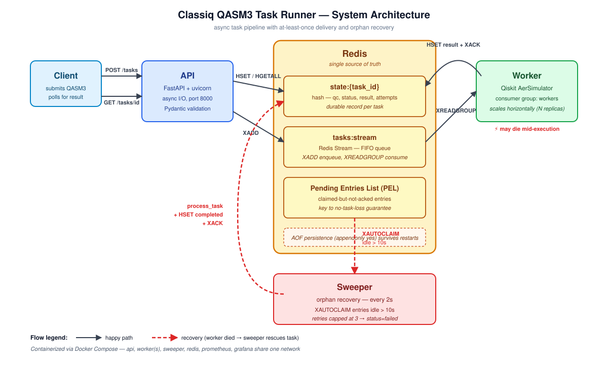
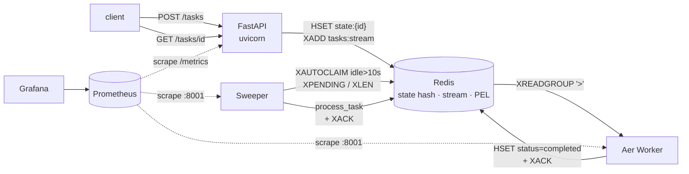
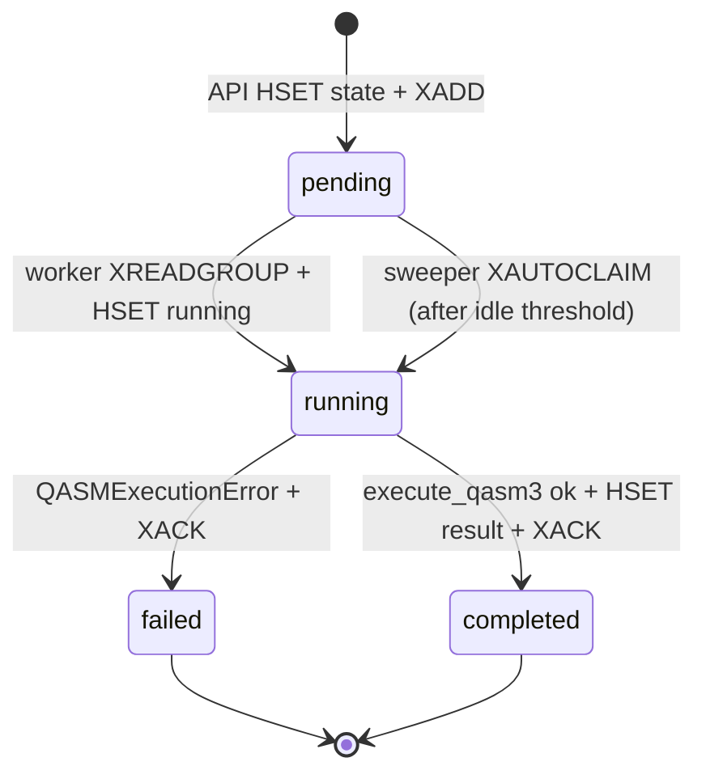
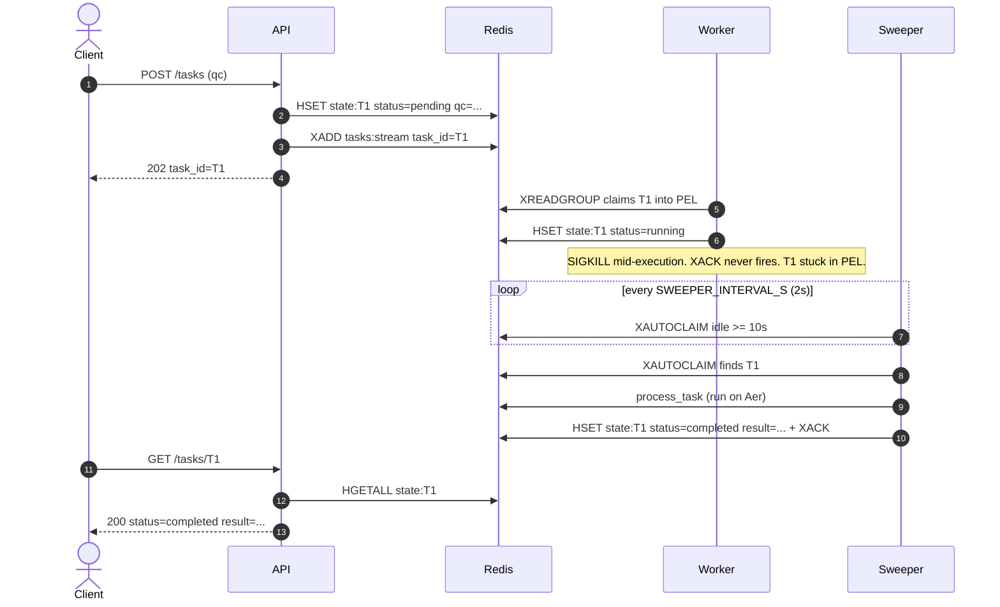

# Classiq QASM Runner

Production-grade async API for executing QASM3 quantum circuits on the Qiskit
[AerSimulator](https://qiskit.github.io/qiskit-aer/). Submits accept in
milliseconds; circuits run on background workers; results are retrievable by
task id. No task is lost when a worker dies mid-execution.

```bash
docker compose up -d --build
```

| Surface | URL |
| --- | --- |
| API | http://localhost:8000 |
| Prometheus | http://localhost:9090 |
| Grafana (anonymous viewer) | http://localhost:3000 |
| Worker / sweeper metrics | scraped internally on `:8001` |

---

## API

### `POST /tasks`

Submit a serialized QASM3 circuit. Returns immediately with a task id.

```bash
curl -X POST http://localhost:8000/tasks \
  -H 'content-type: application/json' \
  -d '{"qc": "OPENQASM 3.0;\ninclude \"stdgates.inc\";\nqubit[2] q;\nbit[2] c;\nh q[0];\ncx q[0], q[1];\nc[0] = measure q[0];\nc[1] = measure q[1];\n"}'

{"task_id":"6c2…","message":"Task submitted successfully."}
```

Body schema: `qc` (string, required) is the only field required by the
assignment. `shots` (int, default `1024`, range 1–100 000) is an optional
extension; omit it and the worker runs 1024 shots, matching the
`NUM_SHOTS = 1024` in the assignment's own Qiskit example.

### `GET /tasks/{task_id}`

Returns one of three shapes:

```json
{"status":"completed","result":{"00":512,"11":512}}
{"status":"pending","message":"Task is still in progress."}
{"status":"error","message":"Task not found."}
```

The same `error` shape carries a different `message` for tasks that failed
during execution (e.g. malformed QASM3).

Not-found responses use **HTTP 200** with `status: error` in the body, matching
the assignment's literal output shape (which specifies only the JSON, not the
HTTP code). HTTP 404 would be the REST-conventional alternative; we follow the
spec as written so a strict shape comparison passes.

### Auxiliary endpoints

| Path | Purpose |
| --- | --- |
| `/healthz` | Liveness — unconditional 200 |
| `/readyz` | Redis ping + consumer-group existence check |
| `/metrics` | Prometheus exposition |
| `/docs`, `/openapi.json` | FastAPI auto-generated API docs |

---

## Assignment requirements traceability

Every requirement from the assignment, mapped to its implementation and the
test that exercises it.

| Assignment requirement | Where it lives | Verified by |
| --- | --- | --- |
| `POST /tasks` accepts `{"qc": "..."}` | `app/api/tasks.py` (`submit_task`) | `tests/test_post_tasks.py::test_post_returns_task_id_and_persists_state` |
| Returns `{"task_id", "message": "Task submitted successfully."}` | `TaskCreated` model in `app/api/tasks.py` | same test as above |
| `GET /tasks/{id}` — completed shape `{"status":"completed","result":{...}}` | `app/api/tasks.py` (`get_task`) | `tests/test_get_task.py::test_get_completed_task_returns_result` |
| `GET /tasks/{id}` — pending shape `{"status":"pending","message":"..."}` | `app/api/tasks.py` (`get_task`) | `tests/test_get_task.py::test_get_pending_task` |
| `GET /tasks/{id}` — not-found shape `{"status":"error","message":"Task not found."}` | `app/api/tasks.py` (`get_task`) | `tests/test_get_task.py::test_get_unknown_task_returns_error` |
| Asynchronous processing | FastAPI async + Redis Streams + dedicated `worker` service | `tests/test_e2e.py::test_full_lifecycle_post_then_worker_then_get` |
| **Task integrity — no submitted task is lost** | Sweeper + `XAUTOCLAIM` + PEL recovery + terminal-state idempotency | `tests/test_chaos.py` and `scripts/chaos.sh` (live recovery proof) |
| Docker Compose orchestrates all components | `docker-compose.yml` (6 services: api, worker, sweeper, redis, prometheus, grafana) | `make up` / `make demo` |
| Production-like error handling + logging | Global RedisError → 503; per-task `failed` state; `structlog` JSON to stdout | `tests/test_redis_unavailable.py`, structured logs visible via `docker compose logs` |
| Python 3.9+ | Python 3.11 | `Dockerfile:1`, `pyproject.toml` (`requires-python = ">=3.11"`) |
| Lightweight web framework (Flask or FastAPI) | FastAPI 0.115 | `pyproject.toml` |
| Dockerfile(s) for all components | One Dockerfile shared by api/worker/sweeper (same Python image, different entrypoints — DRY by design; see `docker-compose.yml`) | `docker compose build` |
| `docker-compose.yml` orchestrates everything | Present at repo root | `docker compose up -d` brings the full stack healthy in ~15 s from cold |
| README with setup, design decisions, usage | This file + 3 ADRs in `docs/adr/` | — |
| Integration tests covering submission, processing, retrieval | `tests/test_e2e.py` (full POST → worker → GET lifecycle, plus concurrent submissions and OpenAPI shape) | `docker compose exec api pytest -q` (24 pass) |
| `qiskit.qasm3` for (de)serialization | `qasm3.loads(qc)` in `app/worker/runner.py` (server-side deserialization; `qasm3.dumps` belongs on the client per the assignment's own example) | `tests/test_worker_happy.py` |
| **Final check**: one-command build & run | `docker compose up -d` | verified end-to-end against a fresh checkout |

---

## Architecture



<details>
<summary>Mermaid source (editable on GitHub)</summary>



</details>

Three application services share one image; each runs a different entrypoint:

| Service | Entrypoint | Role |
| --- | --- | --- |
| `api` | `uvicorn app.main:app` | Validates input, writes task state, enqueues |
| `worker` | `python -m app.worker.main` | Consumes via `XREADGROUP '>'`, runs Aer |
| `sweeper` | `python -m app.sweeper.main` | Reclaims stuck PEL entries via `XAUTOCLAIM` |

Redis hosts three things in one process: the durable result store (a hash per
task), the work queue (Redis Stream), and the in-flight bookkeeping (Pending
Entries List). AOF persistence (`appendonly yes`) is enabled.

### Task lifecycle



### Recovery flow (the headline reliability claim)



---

## Architectural Decisions & Tradeoffs

Every decision below records: **what was chosen**, **what was rejected**,
**the tradeoff we accepted**, and **what would change in a real production
deployment**. The headline three also have full ADRs in
[`docs/adr/`](docs/adr/).

### Async runtime — Redis Streams + a custom Python worker

- **Chosen:** Redis Streams + a small async consumer (XREADGROUP / XACK / XAUTOCLAIM).
- **Rejected:** Celery (a framework I'd be learning during a 48 h deadline; weaker reliability narrative for an interviewer), RQ (similar onboarding cost plus weaker delivery semantics), Kafka (single-producer / single-consumer-group workload; JVM footprint signals over-provisioning), Postgres `SELECT … FOR UPDATE SKIP LOCKED` (excellent if Postgres were already justified by transactional state — it isn't here).
- **Tradeoff accepted:** No admin UI (Flower), no built-in retry-with-backoff, no DAG of dependent tasks, no scheduled/cron tasks. We hand-roll the sweeper instead.
- **In production:** Same primitive at modest scale. Migrate to **Kafka** if retention > 24 h, replay, or multi-consumer fan-out becomes a requirement. The `process_task` boundary is the swap point.

### API framework — FastAPI over Flask

- **Chosen:** FastAPI + uvicorn (async).
- **Rejected:** Flask (sync, thread-per-request).
- **Why it wins here:** Every endpoint is I/O bound on Redis. One uvicorn event loop interleaves thousands of in-flight requests on a single core; Flask would need threads (more memory, context-switch cost).
- **Tradeoff accepted:** Async discipline everywhere (one blocking call ruins the event loop), Pydantic 2 startup overhead.
- **In production:** Same. FastAPI is the right call for any I/O-bound HTTP service.

### Task state store — Redis hash, not Postgres

- **Chosen:** `state:{task_id}` hash in Redis (qc, status, result, attempts, timestamps).
- **Rejected:** Postgres row.
- **Why:** Five fields, no rich-query needs, lifetime ≤ 24 h. Adding a second datastore is over-engineering for this shape.
- **Tradeoff accepted:** No SQL analytics ("tasks by user, by hour"); durability bounded by Redis AOF rather than Postgres WAL + replication.
- **In production:** Move state to **Postgres** once any of these hit — retention beyond 24 h, audit/compliance requirements, analytical queries, or the team wants Adminer/pgAdmin instead of `redis-cli`. The swap point is `process_task`: replace `r.hset` with `db.execute(...)`.

### No-task-loss mechanism — sweeper + XAUTOCLAIM over the PEL

- **Chosen:** Background sweeper claims entries idle > 10 s via `XAUTOCLAIM`, re-runs them through `process_task`. Per-task `attempts` counter caps retries at 3.
- **Rejected:** Manual retry queue in Postgres (more correct, more code); distributed locks (irrelevant — at-least-once + consumer-side idempotency is the standard pattern).
- **Tradeoff accepted:** Recovery latency = `SWEEPER_IDLE_MS` + `SWEEPER_INTERVAL_S` (~12 s by default). Not "instant" — but workers are expected to take seconds to minutes, so the floor is fine.
- **In production:** Raise `SWEEPER_IDLE_MS` to **60–120 s** so a routine GC pause or network blip doesn't trigger a reclaim storm; add a **`tasks:dead` DLQ stream** so `max_retries_exceeded` tasks are inspectable without scanning `state:*` keys.

### Notification model — client polls, no push

- **Chosen:** Client calls `GET /tasks/{id}` periodically until `status != "pending"`.
- **Rejected:** Webhook callback, WebSocket, Server-Sent Events.
- **Why it wins here:** Simulations finish in seconds; each `HGETALL` is ~100 µs; polling load on Redis is trivial up to thousands of concurrent clients.
- **Tradeoff accepted:** Wasted Redis reads; client carries polling logic and timeout.
- **In production (in order of effort):**
  - **Long polling** first — `GET /tasks/{id}?wait=30s` holds the request open and returns when a status change is signaled via a per-task notify-stream. 30× fewer Redis calls than 1 Hz polling.
  - **SSE** (`GET /tasks/{id}/events`) for browser clients — one persistent connection per active task, works through HTTP proxies.
  - **Webhook callbacks** for machine-to-machine + long jobs — `POST /tasks { callback_url, ... }`; worker `POST`s the result. Needs HMAC signing, idempotent receivers, and retry-on-callback-failure.

### Container image — one Dockerfile shared by three services

- **Chosen:** Single Python image; `api` / `worker` / `sweeper` differ only by `command:` in compose.
- **Rejected:** Three separate Dockerfiles.
- **Why it wins:** One layer cache, one `pip install`, one image to scan for CVEs, one place to update Python or pin a dep.
- **Tradeoff accepted:** Each container ships some unused code (worker code in the api container). Negligible — Python source is small.
- **In production:** Stay single-image **until dependency sets diverge** (e.g., a GPU-enabled worker variant pulling in CUDA libraries that the api shouldn't carry). At that point, split with a multi-stage Dockerfile sharing a `base` stage.

### Persistence — Redis AOF, not RDB snapshots

- **Chosen:** `--appendonly yes` (every write appended to a log; default `appendfsync everysec`).
- **Rejected:** RDB-only (periodic snapshots → data loss up to the snapshot interval on `kill -9`).
- **Why:** A task we just accepted (`202`) must not vanish on a redis-server SIGKILL.
- **Tradeoff accepted:** Larger disk usage, slightly slower writes.
- **In production:** Same, plus **S3-backed AOF backup** (cron `aws s3 cp /data/appendonly.aof s3://...`) and either **Redis Sentinel** for HA or a managed offering (**ElastiCache**, **Upstash**) for cross-region failover.

### Observability — Prometheus + Grafana + structlog JSON

- **Chosen:** Pull-based Prometheus metrics; structlog JSON to stdout; provisioned Grafana dashboard.
- **Rejected:** OpenTelemetry + Tempo/Jaeger (gold-plating for a one-hop synchronous flow), ELK with Logstash (1 GB JVM grok tax for already-JSON logs).
- **Tradeoff accepted:** No distributed-trace spans; correlation done by `task_id` propagated through `structlog.contextvars`.
- **In production:**
  - Add **OTel SDK + a tracing backend** (Tempo, Honeycomb, Datadog) the moment a second service hop appears (LLM call, transpiler service).
  - Ship logs via **Filebeat → Elasticsearch** ingest pipeline (skip Logstash — the JSON is already structured).
  - Replace local Prometheus with **managed long-term storage** (Grafana Cloud Mimir, Thanos) for retention beyond 24 h.
  - Add **alert rules** in Prometheus: queue depth > 10 k for 2 min, `task_p95` > 30 s for 5 min, `stream_pending` > 100 for 5 min.

### Unit tests — fakeredis, not testcontainers

- **Chosen:** `fakeredis.aioredis.FakeRedis()` injected via FastAPI's `dependency_overrides`.
- **Rejected:** A real Redis container per test (testcontainers).
- **Why it wins:** ~10× faster (24 tests in 0.6 s vs. ~30 s with containers); deterministic; no Docker dependency for unit-level CI.
- **Tradeoff accepted:** Tests verify behavior against an emulator. Some commands (notably `XAUTOCLAIM` semantics) can drift between fakeredis and real Redis versions.
- **Mitigation:** `tests/test_chaos.py` (opt-in via `--run-chaos`) hits the **real** stack — any fakeredis/real-Redis behavior gap surfaces there.

---

## Reliability Guarantees

Tasks are durable end-to-end under single-worker crash, broker restart, and
ungraceful shutdown.

- **At-least-once delivery.** Submissions are persisted to Redis Streams via
  `XADD` *after* the state row is written, before the API returns `202`.
  Workers consume with `XREADGROUP BLOCK=2000 COUNT=1` (prefetch-1
  equivalent, bounding blast radius to one task per crash) and `XACK` *only*
  after the terminal result is committed.
- **Crash recovery.** Entries sit in the Pending Entries List from claim to
  ack. The sweeper scans `XPENDING` every `SWEEPER_INTERVAL_S` (2 s) and
  `XAUTOCLAIM`s entries idle beyond `SWEEPER_IDLE_MS` (10 s by default).
  Reclaimed entries flow through the same `process_task` path as fresh
  deliveries, with the per-task `attempts` counter incremented.
- **Idempotency.** A re-delivered task whose state is already terminal
  (`completed`/`failed`) short-circuits to `XACK` without re-execution — so
  the worker dying *after* the result was written but *before* `XACK` still
  produces exactly-one execution.
- **Bounded retries.** `MAX_ATTEMPTS_DEFAULT = 3`; the fourth delivery
  transitions the task to `failed` with `max_retries_exceeded`. Surfaces
  through `GET /tasks/{id}` as `{status: error, message: ...}`.
- **Graceful shutdown.** Workers handle SIGTERM via an `asyncio.Event` and
  `add_signal_handler`. The XREADGROUP block timeout (2 s) bounds shutdown
  latency; `stop_grace_period: 60s` in compose gives an in-flight simulation
  time to finish + XACK before SIGKILL.

Assumptions: Redis runs with `appendonly yes`, single-region deployment, and
metrics are eventually consistent on the 5 s scrape interval (dashboards are
for trend detection, not transactional correctness).

---

## Observability

### Structured logs

Every log line is a JSON record on stdout, ready for Filebeat → Elasticsearch
or Promtail → Loki ingestion. Example task lifecycle (correlated by
`task_id`):

```json
{"event":"task.accepted","task_id":"6c2…","qc_len":125,"shots":1024,"service":"api",…}
{"event":"task.started","task_id":"6c2…","attempts":1,"service":"worker",…}
{"event":"task.completed","task_id":"6c2…","duration_s":0.086,"outcomes":2,
 "qubit_bucket":"1-5","service":"worker",…}
```

### Metrics

| Metric | Type | Labels | Source |
| --- | --- | --- | --- |
| `tasks_total` | counter | `event` (accepted, started, completed, failed, reclaimed, idempotent_ack, max_retries, unknown_ack) | api + worker + sweeper |
| `task_duration_seconds` | histogram | `qubit_bucket` (1-5, 6-10, 11-20, 20+) | worker + sweeper |
| `stream_pending` | gauge | — | sweeper (every cycle) |
| `stream_length` | gauge | — | sweeper (every cycle) |
| `http_request_duration_seconds` | histogram | `method`, `route` (template), `status` | api |

Prometheus scrapes all three jobs every 5 s. Grafana auto-loads a
provisioned dashboard at <http://localhost:3000> (anonymous viewer)
with four panels: throughput by event, p50/p95 latency, queue depth,
HTTP p95 by route.

---

## Testing

| Suite | What it covers | Speed |
| --- | --- | --- |
| `tests/test_health.py` | `/healthz` liveness | fast |
| `tests/test_post_tasks.py` | POST persistence, XADD, Pydantic validation | fast |
| `tests/test_get_task.py` | All five state→response mappings | fast |
| `tests/test_worker_happy.py` | Worker XREADGROUP → Aer → state transitions; idempotency; bad QASM | fast |
| `tests/test_sweeper.py` | `XAUTOCLAIM` reclaim, retry cap, terminal-state ack, no-op | fast |
| `tests/test_e2e.py` | Full POST → worker → GET lifecycle; concurrent submissions; OpenAPI schema | fast |
| `tests/test_chaos.py` | Sweeper recovers an orphaned PEL entry against the live compose stack | slow, opt-in via `--run-chaos` |

Inside the container:

```bash
docker compose exec api pytest -q                # default — 21 pass, chaos skipped
docker compose exec api pytest -q --run-chaos    # includes chaos (requires the host running compose)
```

### The chaos test

[`scripts/chaos.sh`](scripts/chaos.sh) is the runnable demo of the headline
reliability claim. It deterministically constructs the "dead worker"
scenario via `redis-cli`:

1. Stop the live worker.
2. `HSET state:T1 …` and `XADD tasks:stream {task_id:T1}` directly.
3. A ghost-worker `XREADGROUP`s the entry — it now sits in the PEL,
   owned by a consumer that will never `XACK`.
4. Restart the live worker (it only sees NEW entries via `>`, not the
   ghost's PEL).
5. Poll `GET /tasks/T1` and wait for the sweeper's `XAUTOCLAIM` cycle to
   reclaim and complete the task. SLA: `SWEEPER_IDLE_MS` (10 s) +
   `SWEEPER_INTERVAL_S` (2 s) + simulation (< 1 s) + slack.

Run it:

```bash
docker compose up -d --build
./scripts/chaos.sh
```

Expected: the script reports `PASS: orphaned PEL entry recovered by sweeper`
with a valid Bell-state distribution (only `00`/`11` outcomes, shots sum to
1024).

---

## Repository layout

```
.
├── app/
│   ├── api/tasks.py          POST/GET handlers
│   ├── bootstrap.py          Idempotent XGROUP CREATE
│   ├── core/logging.py       structlog ⇄ stdlib JSON config
│   ├── domain/qasm.py        Test fixtures (BELL_QASM3)
│   ├── main.py               FastAPI app factory, /healthz, /readyz, /metrics
│   ├── observability/
│   │   ├── metrics.py        Prometheus counters/histograms/gauges
│   │   └── server.py         start_http_server helper for non-FastAPI processes
│   ├── processing.py         Shared process_task: idempotency + retry cap
│   ├── redis_io/client.py    Async Redis singleton
│   ├── sweeper/main.py       XAUTOCLAIM loop + gauge updates
│   └── worker/
│       ├── main.py           XREADGROUP loop
│       └── runner.py         qiskit.qasm3.loads → Aer → counts
├── docker-compose.yml
├── Dockerfile
├── ops/
│   ├── grafana/
│   │   ├── dashboards/classiq.json
│   │   └── provisioning/...
│   └── prometheus/prometheus.yml
├── pyproject.toml
├── scripts/chaos.sh          Headline reliability demo
└── tests/
    ├── conftest.py           fakeredis + api_client fixtures, --run-chaos opt-in
    ├── test_chaos.py         pytest equivalent of scripts/chaos.sh
    ├── test_e2e.py           Full lifecycle + concurrent submissions + schema
    ├── test_get_task.py
    ├── test_health.py
    ├── test_post_tasks.py
    ├── test_sweeper.py
    └── test_worker_happy.py
```

---

## Capacity & Bottlenecks (back-of-the-envelope)

Numbers below are estimates for a **single 16-core / 32 GB host**, average circuit
**10 qubits / 1024 shots**, simulation cost **~50 ms**. They're meant to identify
the *order* in which things saturate, not as benchmark guarantees.

### Per-component capacity

| Component | Per-task cost | Max throughput (single replica) | What saturates first |
| --- | --- | --- | --- |
| **API** (FastAPI/uvicorn) | ~300 µs (2 Redis hops + parse) | ~10 000 POST/s, ~30 000 GET/s | CPU at ~4 uvicorn workers/host. Async I/O loop handles thousands of in-flight requests on one core because every step waits on Redis. |
| **Worker** (Aer) | ~50 ms (simulation dominates) | **~20 tasks/s** | CPU pegged at 100% during simulation. **This is the bottleneck.** Scales linearly with replicas. |
| **Sweeper** | trivial; XAUTOCLAIM only fires when PEL has stale entries | thousands of reclaims/s | Almost never bottleneck. One replica suffices for normal load. |
| **Redis** | ~6 ops per task end-to-end | ~100 000 ops/s (single-threaded) | At ~16 000 tasks/s; we use ~2% of capacity on one host. |

### Per-task latency budget

| Step | Time | % of end-to-end |
| --- | --- | --- |
| API parse + Pydantic + HSET + XADD | ~300 µs | 0.6% |
| Worker XREADGROUP wake | ~1 ms | 2% |
| **Aer simulation** | **~50 ms** | **97%** |
| Worker HSET result + XACK | ~200 µs | 0.4% |

→ Server-side p95 ≈ **~50 ms**. Client-perceived latency adds polling jitter
(0–1 s at 1 Hz); long-polling or SSE collapses that.

### Sustained throughput on one box

```
16 cores × 20 tasks/sec per worker  =  ~320 tasks/sec sustained
                                       (target 70-80% utilization → ~250 tasks/sec)
```

Heavier circuits scale as **2^n**:

| Circuit size | Sim time | Tasks/sec on one 16-core box |
| --- | --- | --- |
| 10 qubits / 1024 shots | ~50 ms | **~320** |
| 15 qubits / 1024 shots | ~500 ms | ~32 |
| 20 qubits / 1024 shots | ~10 s | ~1.6 |
| 25 qubits / 1024 shots | ~5 min | <0.1 |

### When to grow horizontally

| Symptom | Where to look | Threshold | Action |
| --- | --- | --- | --- |
| Queue growing without bound | `XLEN tasks:stream` (Grafana panel) | climbs and doesn't drain | **Add worker replicas** — `docker compose up -d --scale worker=N` |
| Workers pegged | per-replica worker CPU | > 80% sustained | Add worker replicas |
| Tail latency drift | `task_duration_seconds` p95 | rising without circuit-size change | Workers saturated; verify CPU, then add replicas |
| Redis hot | Redis CPU / `INFO commandstats` latency | CPU > 70% or per-op > 1 ms | Vertical Redis first → read replicas for GET path → shard by stream key |
| API CPU hot (rare) | api container CPU | > 60% sustained | `--scale api=N` behind a load balancer |
| Stale in-flight work | `stream_pending` gauge | > 100 sustained | Investigate stuck workers; consider a second sweeper replica |

### Order in which things actually break

1. **Workers** (always first) — Aer is CPU-bound; horizontal scaling is the cheapest 10× gain.
2. **Redis** — much later; vertical scaling first, then read replicas, then shard by stream.
3. **API** — rare; one async uvicorn worker comfortably handles thousands of req/s.
4. **Network** — never, at these payload sizes (~2 KB `qc`, ~500 B result).

At **10× current load (~3 000 tasks/s of 10-qubit circuits):** ~10 worker boxes,
2 API boxes, **one** Redis (still <30% loaded). Most production growth never
touches anything except the worker count.

---

## Scaling

All three application services are stateless; horizontal scaling is a
single `--scale` flag away:

```bash
docker compose up -d --scale worker=4 --scale sweeper=2
```

- `WORKER_ID` / `SWEEPER_ID` default to `<role>-${HOSTNAME}` so each
  replica registers as a **distinct consumer** in the Redis Streams
  consumer group (compose hands every replica a unique hostname).
- The `worker` service uses `XREADGROUP COUNT=1`, so adding workers
  linearly increases throughput up to the AerSimulator CPU budget per
  replica.
- The `sweeper` service uses `XAUTOCLAIM` which is atomic at the entry
  level — multiple sweepers race safely; only one wins each reclaim.
- Prometheus is configured to scrape `worker:8001` and `sweeper:8001`
  via Docker's service DNS; for >1 replica per service in production,
  switch to `dns_sd_configs` (or use the Kubernetes service-discovery
  config) so every replica is scraped individually.

## Robustness

What happens when the world misbehaves:

| Scenario | Outcome |
| --- | --- |
| Worker `SIGKILL`'d mid-execution | PEL retains the entry. Sweeper reclaims after `SWEEPER_IDLE_MS` and re-runs via `process_task`. Idempotency on terminal state prevents double-execution when the worker died AFTER `HSET completed` but BEFORE `XACK`. Proven by `scripts/chaos.sh`. |
| Worker `SIGTERM` (graceful) | Current task finishes, terminal `HSET` + `XACK` fire, loop checks stop event, process exits. `stop_grace_period: 60s` buffers the in-flight simulation. |
| Redis goes down | Global `RedisError` handler returns spec-shaped `{"status":"error","message":"Backend unavailable…"}` with HTTP 503. No 500-with-traceback leaks. Worker/sweeper loops catch the error, log `worker.loop_error`, sleep 1 s, retry. |
| Malformed QASM3 | `process_task` catches `QASMExecutionError`, transitions state to `failed` with the parse-failure message. `XACK` fires (no retry storm). `GET /tasks/{id}` reports `{"status":"error","message":"QASM3 parse failed: …"}`. |
| Oversized payload (> 1 MiB `qc`) | Pydantic returns HTTP 422 with a validation error before any Redis write. |
| Out-of-range `shots` (≤ 0 or > 100 000) | Pydantic returns HTTP 422. |
| Same task delivered twice (e.g. sweeper re-claim after slow XACK) | Idempotency short-circuit: terminal-state tasks are XACK'd without re-execution. `tasks_total{event="idempotent_ack"}` counter ticks for observability. |
| `qiskit.qasm3.loads` raises an unexpected exception | Caught as a generic `Exception`, state set to `failed` with `unexpected: …`, logged with `log.exception` (stack trace in JSON), `XACK` fires. |
| Worker container crashes / OOMs | Docker restarts it (`restart: unless-stopped`). Sweeper handles any task whose PEL entry the dead worker held. |
| Submitted task takes > 3 attempts to complete | After the 4th delivery, `process_task` transitions state to `failed` with `max_retries_exceeded`. Stops the retry loop, surfaces through `GET`. |
| All workers down for an extended window | New submissions queue on the stream. Sweeper alone won't help (it only reclaims from PEL, not the stream). Workers process the backlog when they come back. |

## Production hardening (what we'd do differently)

Beyond the per-decision "in production" notes above, these are capabilities
deliberately left out of the 48-hour scope. Grouped by category and ordered
by likely first need.

### Client experience

- **Long polling first**, then SSE for browsers, then webhook callbacks for
  machine-to-machine — see the "Notification model" decision above. The
  per-task notify side-stream is published from `process_task` after the
  terminal `HSET`.
- **Result TTL.** `EXPIRE state:{id} 86400` after `completed`/`failed`.
  Today `state:*` keys grow without bound (~2.6 KB/task, ~24 h headroom
  on a 32 GB host at 320 tasks/s).
- **Large-result offloading.** If circuits start producing 100 MB
  histograms, write to S3 and store the URL in the hash. Today the
  `result` JSON lives in-line (fine for thousand-key counts; not for
  millions).
- **API versioning.** `/v1/tasks` path prefix; the unversioned shape today
  is fine for an assignment but ties us to it.

### Reliability & disaster recovery

- **DLQ stream** (`tasks:dead`). `max_retries_exceeded` tasks flow here
  for inspection and manual replay. Today they sit in `state:*` with
  status=failed — discoverable only via `KEYS state:*` or a `SCAN`.
- **Multi-region.** Redis AOF replicated cross-region (Sentinel,
  ElastiCache global datastore, or Upstash global). The state hash +
  stream both live in Redis, so it's one component to replicate.
- **Stuck-worker detection.** Alert on absence of `worker.alive` logs
  for > 30 s — orthogonal to the sweeper, which only catches *in-flight*
  tasks, not "all workers offline."
- **Pod Disruption Budget** + `terminationGracePeriodSeconds` if moving
  to Kubernetes (analogous to compose's `stop_grace_period: 60s`).

### Security & multi-tenancy

- **AuthN/Z.** API keys minimum; JWT/mTLS for service-to-service.
  `/metrics`, `/healthz`, `/readyz` stay unauthenticated by convention.
- **Per-client rate limiting.** Redis token bucket
  (`INCR rate:{api_key}:{minute}` + `EXPIRE`). Stops one runaway client
  from saturating the worker pool and the queue.
- **Backpressure on POST.** Today `XADD ... maxlen=100_000` silently
  evicts oldest entries. Production: reject with `429` once
  `XLEN > threshold` rather than dropping.
- **HTTP status realignment.** Today `Task not found` returns
  `200 + status:error` (assignment's literal shape). Production: `404`
  for the not-found case, `200` only for actual results.
- **Audit logging.** Who submitted what, when. Today's structlog has the
  info; production needs a retention policy + immutable destination.

### Operational tooling

- **Distributed tracing.** OTel SDK + Tempo / Honeycomb / Datadog. Worth
  it the moment a second hop appears (LLM, transpiler, anything async
  outside Aer).
- **Per-process metrics.** `prometheus_client.process_collector` adds
  memory / CPU / fds per service — useful for catching slow leaks before
  they OOM the container.
- **Pre-built alert rules.** Today the Grafana dashboard is for
  inspection only. Production needs Prometheus alert rules on
  `XLEN`, `task_duration_seconds` p95, and `stream_pending`.
- **Kubernetes manifests.** Compose maps cleanly: Deployment per service,
  HPA on workers driven by **queue depth** via KEDA (not CPU — a worker
  blocked on `XREADGROUP` shows 0% CPU even when 10 k tasks are queued).
- **CI/CD.** Lint + type check + pytest in CI (GitHub Actions), build &
  push image on tag, deploy via ArgoCD or similar. Today everything
  runs locally.

### Cost & efficiency

- **GPU-backed worker variant** for circuits beyond ~15 qubits — Qiskit
  Aer supports GPU. Today CPU only; 25-qubit circuits would be effectively
  unrunnable.
- **Result caching** keyed by `hash(qc, shots)`. Deterministic circuits
  with a fixed seed don't need re-execution. Saves CPU on repeat
  submissions; needs care around `random_seed`.
- **Autoscaling workers** on queue depth via KEDA — scales pods up under
  burst, down to a floor during idle hours.

---

## Development

```bash
# bring up the full stack
docker compose up -d --build

# run unit + integration tests (21 passing)
docker compose exec api pytest -q

# tail correlated structured logs
docker compose logs -f api worker sweeper

# poke metrics
curl -s localhost:8000/metrics | grep tasks_total
```

Python 3.11. Dependencies in `pyproject.toml`; FastAPI, redis (async),
qiskit, qiskit-aer, structlog, prometheus-client, pytest, fakeredis, httpx.
